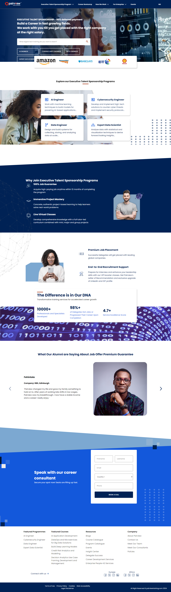
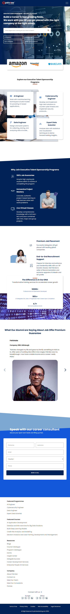
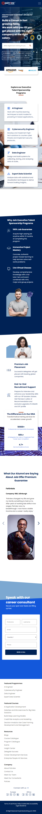

# Executive Talent Sponsorship Program Landing Page

## Overview

This project is a landing page designed to promote the Executive Talent Sponsorship Program. It features an interactive and engaging user interface with a hero section, testimonial slider, program descriptions, and more. The page is built using React and CSS, utilizing various assets and animations to enhance the user experience.

## Features

- **Hero Section**: Includes a background video and an input field for user queries, with options for different tech fields.
- **Interactive NavBar**: Includes dropdowns and hover effects for a seamless navigation experience.
- **Company Logos**: Scrollable section displaying partner companies.
- **Program Cards**: Highlighting different sponsorship programs such as AI Engineer, Cybersecurity Engineer, Data Engineer, and Expert Data Scientist.
- **Why Join Section**: Detailed benefits of joining the programs, supported by Lottie animations.
- **Testimonial Slider**: A carousel showcasing alumni testimonials with navigation arrows.
- **Metrics Section**: Showcasing key metrics like the number of professionals developed, job placement rate, and service excellence score.

## Technologies Used

- **React**: A JavaScript library for building user interfaces.
- **CSS**: For styling components and layout.
- **HTML**: Markup structure of the page.
- **Lottie**: For animations, using JSON files to render interactive animations.

## Screenshots

